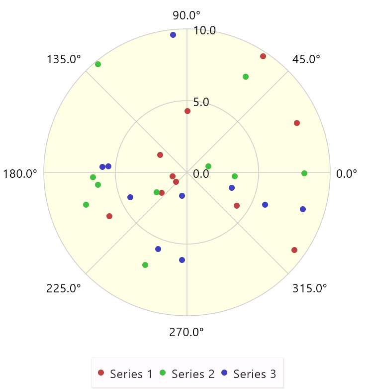
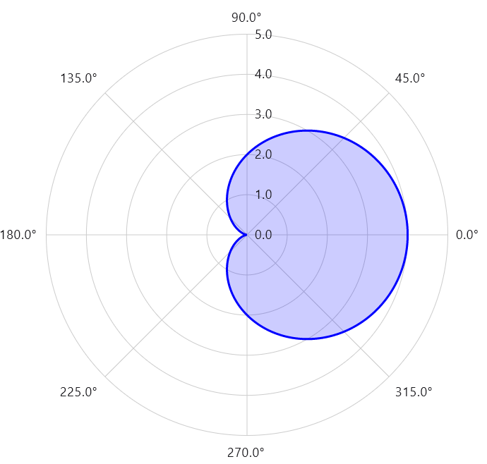
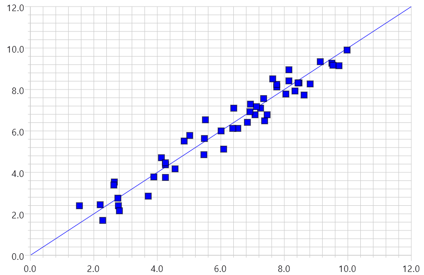
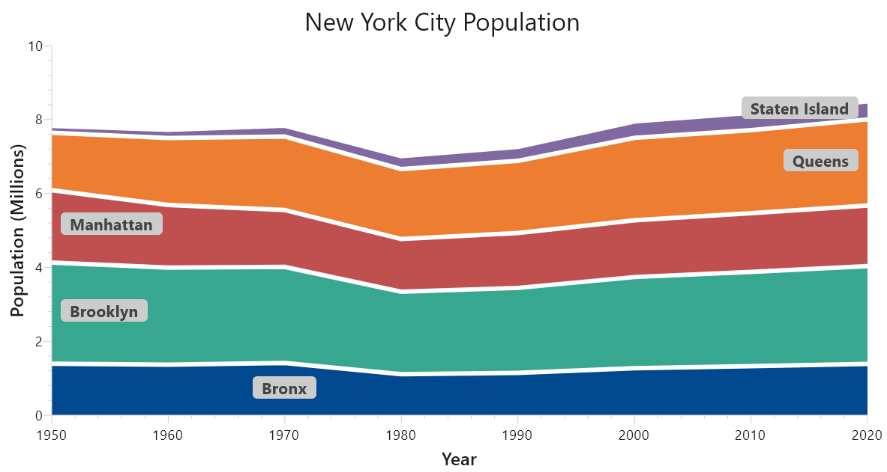
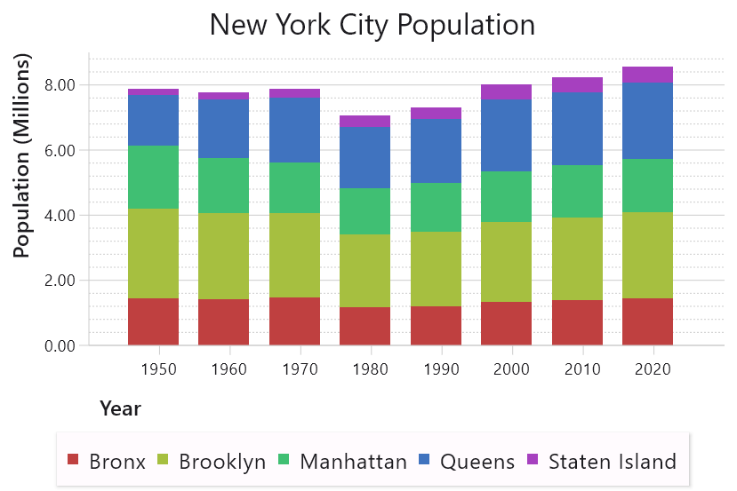
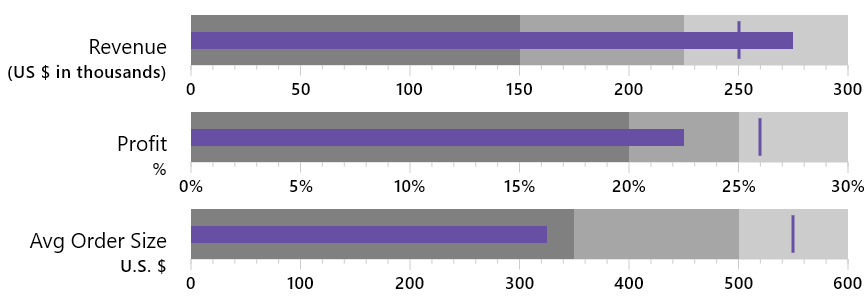

[](https://central.sonatype.com/artifact/io.github.koalaplot/koalaplot-core)
[](http://kotlinlang.org)
[](https://koalaplot.github.io/koalaplot-core/api/0.5.1/)
[](https://github.com/KoalaPlot/koalaplot-core/tree/main/LICENSE.txt)

# Koala Plot

Koala Plot is a [Compose Multiplatform](https://www.jetbrains.com/lp/compose-mpp/) based charting and plotting library
allowing you to build great looking interactive charts for
[Android](https://developer.android.com/jetpack/compose), desktop, ios, and web using a single API and code base.

Try out
the [web version of the samples](https://koalaplot.github.io/koalaplot-samples/wasmJs/productionExecutable/index.html)
for a quick look at the possibilities when using Koala Plot. Note that this uses
the [alpha Kotlin wasm Compose web-canvas](https://kotlinlang.org/docs/wasm-overview.html) capability, and you'll
need a browser supporting the [wasm garbage collection feature](https://github.com/WebAssembly/gc). For more information
see [https://kotl.in/wasm_help](https://kotl.in/wasm_help).

This project is in a pre-release experimental/alpha state. We encourage you to give it a try, make suggestions for
improvement, and even [contribute](https://github.com/KoalaPlot/koalaplot-core/blob/main/CONTRIBUTING.md)! It is
expected that the API surface and functionality will change as we gain experience using the library in applications.

# Current Features

Most elements of a plot are Composables and can therefore be easily customized. This includes things like colors, fonts,
borders, shapes, user interaction, etc. Web support is provided by the Compose-web Canvas support currently in alpha.

* Pie and donut chart
    * Composable slices, with default implementation that can react to hovering
    * Optional Composable labels and Composable connectors with provided linear and bezier implementations
    * Composable content for donut chart centers
    * Customizable first-draw animation
* Line graphs
    * Linear or Log y-axis
    * Numeric or category x-axis
    * Composable axis titles and value labels
    * Optional Composable symbols for data points
    * Optional Composable symbols at each data point with default implementations
    * Zoom and pan one or both axes (Android only, for now)
    * Optional shaded areas (area chart)
* Stacked area graphs
    * Plots multiple lines with shaded areas between them and accumulated values
    * Similar feature set as the Line chart
* Vertical bar graph
    * Linear or Log y-axis
    * Numeric or category x-axis
    * Composable vertical bars with a provided default implementation
    * Support for clustered and stacked bars
    * Support for negative values and bars that don't start at 0
    * Customizable first-draw animation
    * Zoom and pan one or both axes (Android only, for now)
* Bullet Graph
    * Individual or multiple vertically aligned bullet graphs
* Radar/Polar/Spider plots
  * Lines, areas, symbols, or a combination
  * Configurable origin position and angle orientation (clockwise/counter-clockwise)
* Chart layout
    * Combines an optional Composable title, plot, and legend with any of 4 positions
* Legends
    * Single column
    * Flow-layout

# Getting Started

1. Add the mavenCentral and compose repositories to your project's build.gradle.kts

```kotlin
repositories {
    mavenCentral()
    maven("https://maven.pkg.jetbrains.space/public/p/compose/dev")
}
```

2. Include Koala Plot core as a dependency in your project's build.gradle.kts

```kotlin
dependencies {
    implementation("io.github.koalaplot:koalaplot-core:0.5.2")
}
```

You can also see a complete example of a build.gradle.kts in
the [samples](https://github.com/KoalaPlot/koalaplot-samples).

3. Start coding

```kotlin
    BulletGraph {
    label {
        Column(horizontalAlignment = Alignment.End,
            modifier = Modifier.padding(end = KoalaPlotTheme.sizes.gap)) {
            Text("Revenue 2005 YTD",
                textAlign = TextAlign.End)
            Text("(US $ in thousands)",
                textAlign = TextAlign.End)
        }
    }
    axis { labels { "${it.toInt()}" } }
    comparativeMeasure(260f)
    featuredMeasureBar(275f)
    ranges(0f,
        200f,
        250f,
        300f)
}
```

# Documentation

- [Latest build](https://koalaplot.github.io/koalaplot-core/api/0.5.2)
- [Release 0.5.2](https://koalaplot.github.io/koalaplot-core/api/0.5.2)

Also see the [sample repository](https://github.com/KoalaPlot/koalaplot-samples) for code examples.

# Contributing

Contributions are welcome. Further details can be found in the
[Contributing Guidelines](https://github.com/KoalaPlot/koalaplot-core/blob/main/CONTRIBUTING.md)

# Examples








